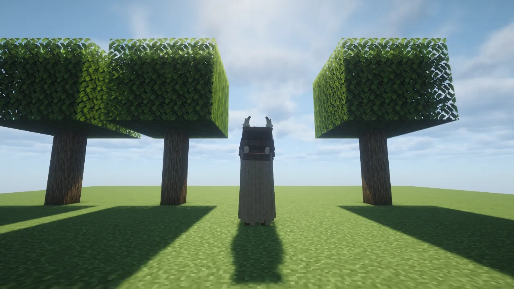
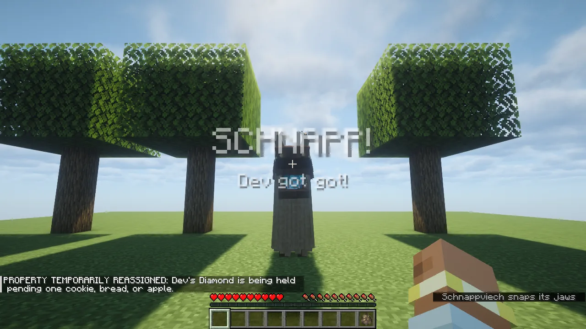
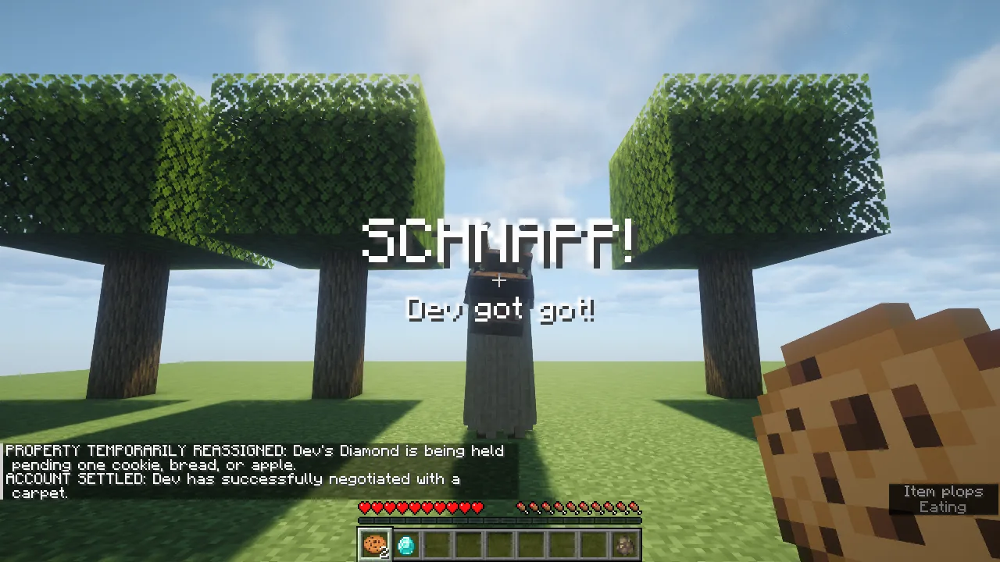
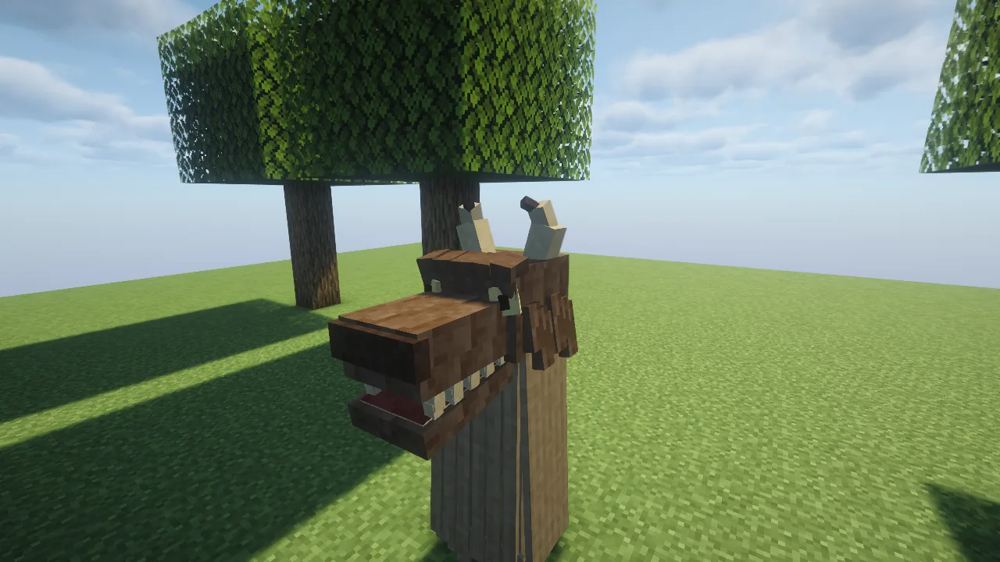
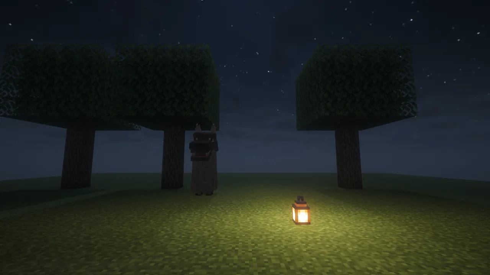

A **Schnappviech** is a towering folklore prankster in a shaggy horned mask with long wooden jaws.
It follows a player, giggles now and then as a clue, **steals one item**, and wants **a snack** to
give it back. It can't be killed, but catch it and hit it three times and it surrenders.

## The prank

1. **It picks someone.** One Schnappviech visits at a time, usually every **2 to 4 hours**, choosing
   a player in survival or adventure in the Overworld. The same player isn't picked again for
   **six hours**.
2. **It stalks.** It appears behind you and waits about 12 blocks back for a minute or two, with
   soft footsteps and a quiet **giggle every 30 to 60 seconds**. When you look at it, it **freezes**.
   Turning around doesn't move it, but walking away does: it finds a new spot out of your sight.
3. **It steals.** When its time is up it closes in, if it has an open way to you that you aren't
   watching (never through a wall), and takes **one item**: from your inventory, hotbar, armour or
   offhand. One from a stack; a shulker box goes with everything in it. Names, enchantments and
   damage are kept.
4. **It runs.** Then it runs off. It can swim across deep water and climb out onto a bank.

## Getting it back

- **Beat it:** land **three hits**, at least half a second apart, and it surrenders. Friends can
  help. It never dies, never attacks anyone and never breaks blocks.
- **Pay it:** if it gets away (after 30 seconds of running, 12 blocks away and out of your sight),
  everyone sees **"SCHNAPP! *player* got got!"** and chat says what it's holding. It comes back to
  loiter nearby. **Right-click it with a cookie, bread or an apple** to get the item back. Anyone can
  pay for you. Beating it still works too.

- The item drops toward its owner and is **reserved for them**: nobody else can pick it up, and it
  doesn't burn or despawn. If your inventory is full, it waits on the ground for you.
- If you're offline when a friend pays, it comes back the next time you log in.
- Your item is safe through saves and restarts. The Schnappviech comes back for any unpaid debt, and
  never steals from you again while you owe it.

## Good to know

- Players in creative or spectator are never robbed.
- `/schnappviecher status` shows the item it's holding of yours.
- Operators: `/schnappviecher visit <player>` and `/schnappviecher dismiss`.

